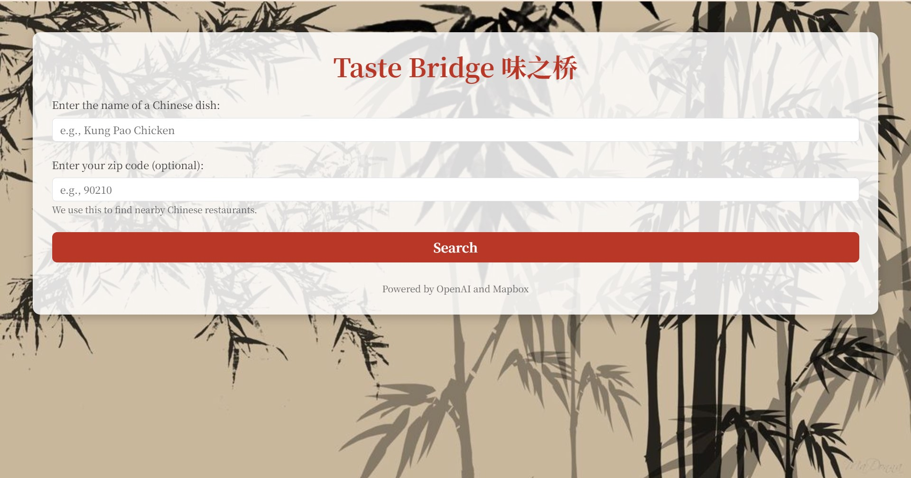
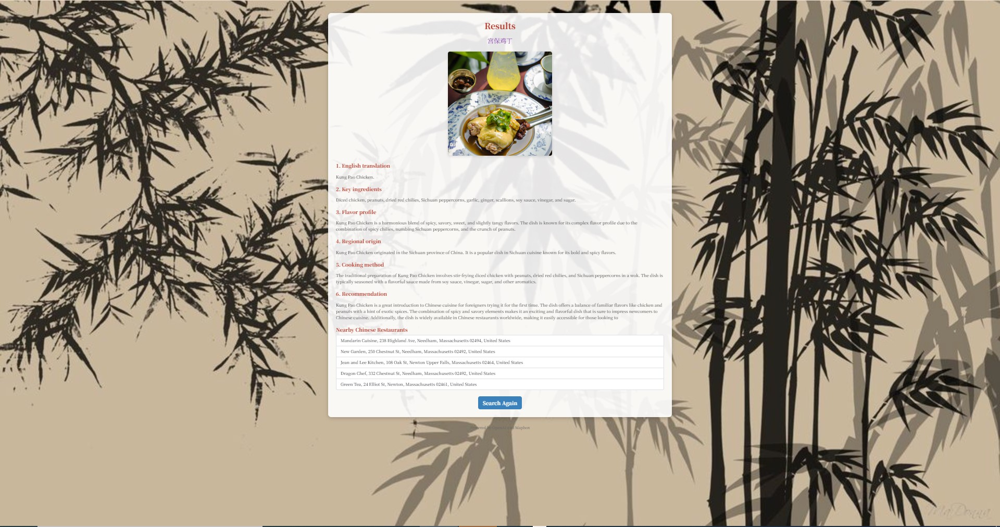

# Term Project
# Amy Meng Hatton Tong

# Project Proposal：Taste Bridge 味之桥

## 1. The Big Idea
The primary goal of our project is to create an interactive website that translates Chinese food names into English and offers a comprehensive introduction to each dish. By leveraging the OpenAI API, we aim to provide users with detailed insights into Chinese cuisine, including the ingredients, flavor profiles, regional origins, and cooking methods of various dishes. Additionally, we’ll feature a recommendation system to guide foreigners on whether each dish is suitable for those trying Chinese food for the first time. Our minimum viable product (MVP) will be a functional website where users can input a Chinese food name to receive an English translation and a brief description. For our stretch goal, we aim to add a feature where users can input their zip code to locate nearby Chinese restaurants offering these dishes, enhancing the user experience with both informational and practical value. 

## 2. Learning Objectives
This project offers us opportunities to build both collective and individual skills. As a team, our primary goal is to develop proficiency in web development and API integration, particularly focusing on creating a user-friendly interface that incorporates real-time language processing. We also aim to deepen our understanding of Python and learn more about web design techniques and UI/UX optimization. Additionally, we all hope to enhance our collaborative skills through version control and regular project updates, ensuring a smooth development process. 

## 3. Implementation Plan
Our project will utilize several tools and frameworks, starting with Flask for website development, which will allow us to create a responsive and intuitive frontend. We will use the OpenAI API for language translation and natural language processing tasks to retrieve detailed descriptions, ingredient lists, and cooking instructions. For our stretch goal, we will integrate the Mapbox’s Geocoding API to display nearby Chinese restaurants based on user’s zip code input. In our initial phase, we will focus on MVP completion, ensuring the site effectively translates food names and delivers essential details. If uncertainties arise in implementation, we will conduct further research on OpenAI API usage and explore additional libraries like Google Maps API if we need more detailed location-based data for the stretch goal. By adopting an agile approach with regular iterations, we will gradually expand the site’s functionality, making adjustments based on user feedback and testing. 

## 4. Project Schedule
We have allocated approximately 4-5 weeks for this project and created the following timeline to guide our progress. This schedule is flexible and will be updated as the project evolves:

- **Week 1:** Research APIs (OpenAI and Mapbox), finalize project requirements, and set up the project repository.
- **Week 2:** Begin development by setting up the backend with Flask and designing the basic UI for the frontend.
- **Week 3:** Implement core functionalities, including OpenAI API integration for translations and dish descriptions, and frontend-backend communication.
- **Week 4:** Test the MVP thoroughly, refine the user interface, and address bugs or usability issues. Begin work on stretch goals if the MVP is complete.
- **Week 5:** Complete stretch goals (e.g., restaurant finder using Mapbox), finalize testing and debugging, and prepare for the final presentation.

This timeline ensures that we prioritize the core functionality before exploring advanced features, allowing us to deliver a polished MVP within the given time frame.

## 5. Collaboration Plan
Our collaboration will be a mix of task delegation and pair programming, chosen to maximize efficiency while maintaining flexibility:

- **Task Delegation:** We will divide responsibilities into frontend, backend, and documentation tasks:
  - **Frontend:** Designing and developing the user interface using HTML, CSS, and JavaScript.
  - **Backend:** Implementing API integrations and the logic for processing user inputs and retrieving results.
  - **Documentation:** Both members will collaborate on documenting progress, ensuring clarity in code and project deliverables.

- **Pair Programming:** For complex components, such as API integration and debugging, we will pair program to combine expertise and ensure smooth functionality.

- **Development Methodology:** We will follow an **agile methodology** with weekly sprints. Each sprint will include planning tasks, reviewing progress, and adjusting as needed. This methodology was chosen for its flexibility and regular feedback loops, which are essential for managing uncertainties in API integration and project scope.

- **Communication Tools:** We will use WeChat for daily communication, Word Online for planning, and GitHub Projects for tracking tasks and managing version control.

This collaborative approach ensures clear communication, efficient task management, and high-quality outputs.

## 6. Risks and Limitations
The main risks to the project include:

- **API Limitations:** OpenAI and Mapbox APIs may have rate limits or cost constraints that could affect functionality.
- **Integration Challenges:** Combining multiple APIs seamlessly and ensuring consistent data retrieval for both frontend and backend can be complex.
- **Data Quality:** The accuracy of translations, dish descriptions, and recommendations heavily depends on the API responses, which may require fine-tuning.
- **Time Constraints:** Unexpected challenges during API integration or debugging may delay progress.

To mitigate these risks:
- We will prototype and test critical API components early to identify limitations.
- Implement fallback mechanisms and error handling to address API failures.
- Regularly review and adjust our timeline to stay on track.

## 7. Additional Course Content
The following course topics would be beneficial for our project:

- **Advanced API Integration:** Understanding best practices for using APIs efficiently and handling complex responses.
- **UI/UX Design Principles:** Learning advanced CSS techniques to improve user engagement and make our site more intuitive.
- **Database Management:** Exploring how to structure and manage data effectively if we decide to expand the functionality in the future.

This plan ensures a structured yet adaptable approach, enabling us to tackle potential challenges effectively while delivering a functional and engaging project.

Project Introduction
Imagine you walk into a Chinese restaurant that boasts an extensive, authentic menu. The dishes have intriguing Chinese names, but you’re unsure what to order. Is it spicy? Sweet? Vegetarian-friendly? Or maybe you’ve tried a fantastic dish before, but you don’t know its ingredients, or where you can find it again nearby.

For many people in the U.S., exploring Chinese cuisine can feel like a mix of excitement and uncertainty. While Chinese food is widely loved, the language barrier and cultural differences can make it challenging to fully appreciate the depth and diversity of the cuisine.

This is why we created Taste Bridge.

Our website is designed to empower users to explore Chinese food with confidence. Whether you’re a curious foodie, a first-time diner, or someone looking for nearby restaurants, the app provides:

Clear translations of dish names.
Detailed descriptions, including ingredients and flavor profiles.
Realistic AI-generated images to visualize the dishes.
Recommendations for Chinese restaurants near your location.

# User Instructions

## 1. Prerequisites

Before running the project, ensure you have the following installed:

- Visual Studio Code
- Python extension
- Flask extension
- pip (Python package installer)
- A Mapbox API key
- An OpenAI API key

## 2. Installation and Usage

1. Clone this repository
2. Install the required dependencies:

pip install flask python-dotenv openai requests

3. Create a .env file in the project root directory and add your API keys:

OPENAI_API_KEY=your_openai_api_key
MAPBOX_API_KEY=your_mapbox_api_key

4. Run the app.py
5. Open your browser and visit the url: http://127.0.0.1:5000/
6. Enter the name of the Chinese cuisine and your zipcode
7. See the results of the cuisine's info and recommended nearby restaurants
8. Enjoy the food!
   

# Website Preview

This is how our website looks! It blends traditional Chinese cultural elements with modern design to create an inviting and authentic experience for users.

## Key Design Features:
- Chinese Symbolism: Incorporates iconic Chinese symbols like bamboo to evoke a sense of tradition and cultural richness.
- Red Color Palette: Uses shades of red, a color associated with good fortune and happiness in Chinese culture, as the primary accent throughout the website.
- Modern and Clean Design: The layout is simple and intuitive, ensuring a seamless experience for users of all backgrounds.

### Homepage Screenshot

### Results Page Screenshot

Our design combines elegance and functionality, inviting users to dive into the world of Chinese cuisine with confidence and excitement.
